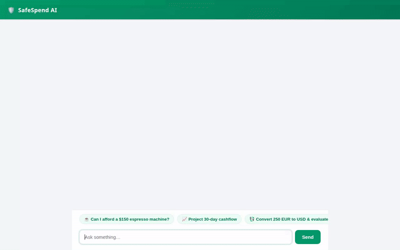

# SafeSpend AI — Autonomous Financial Agent & Affordability Concierge

[](https://safespend-ai-frontend-859808442959.us-east1.run.app)

👉 **Experience the Live App**: [https://safespend-ai-frontend-859808442959.us-east1.run.app](https://safespend-ai-frontend-859808442959.us-east1.run.app)



**SafeSpend AI** is an autonomous conversational **Financial Agent** built with the Google Agent Development Kit (ADK) and Gemini. It acts as a personalized financial advisor, evaluating user purchasing decisions by querying live database balances, projecting multi-day cashflows using code sandboxes, and rendering interactive decision cards.

---

## How the Financial Agent Works (Under the Hood)

When a user interacts with the Financial Agent (e.g., asking *"Can I afford a $1,200 laptop right now?"*), the system executes the following autonomous workflow:

```
[User Query] ➡️ [FastAPI Server] ➡️ [Vertex AI Reasoning Engine]
                                            │
                              ┌─────────────┴─────────────┐
                              ▼                           ▼
                    [Firestore Database]        [Vertex AI Memory Bank]
                    (Real Balances & Bills)    (Long-term User Rules)
                              │                           │
                              └─────────────┬─────────────┘
                                            ▼
                                [Python Code Sandbox]
                               (Exact Cashflow Math)
                                            ▼
                               [A2UI Card Component]
                                            ▼
                             [Interactive Web Frontend]
```

### 1. Personalized Data Access (No Hallucinated Advice)
The Financial Agent does not rely on static knowledge or generic guesses. It has direct access to the user's private financial records:
* **Firestore Database**: Fetches real-time checking balance, monthly net income, credit obligations, and upcoming recurring bills (rent, utilities, loans).
* **Vertex AI Memory Bank**: Retains long-term user preferences across sessions (e.g., target emergency savings buffer, preferred payment methods, risk tolerance).

### 2. Exact Math via Code Sandbox
To ensure 100% mathematical accuracy without LLM calculation errors:
* The agent invokes `simulate_cashflow_projection()` in the **Agent Engine Sandbox Code Executor**.
* It runs an isolated Python simulation projecting the user's daily cash balance for 30–60 days after deducting the item price and upcoming bills.

### 3. Multimodal Generation & Store Discovery
* **Product Photos & Videos**: Generates visual previews of items via Vertex AI models (`gemini-3.1-flash-lite-image` and `gemini-omni-flash-preview`), saving artifacts directly to Google Cloud Storage.
* **Store Geocoding**: Discovers nearby physical merchants via Google Maps APIs (`geocode_address` and `find_nearby_places`).

### 4. Rich A2UI Decision Rendering
* Formats responses using **Agent-to-User Interface (A2UI)** components (Card, Column, Row, Text, Image) to display clear verdict badges (🟢 *Affordable*, 🟡 *Affordable with Installments*, 🔴 *Over Budget*) and breakdown cards.

---

## Key Capabilities & Wired Google Cloud Services

The Financial Agent's logic is defined in [`app/`](file:///config/.gemini/antigravity/scratch/build-with-gemini/safespend-ai/app/) and integrates the following Google Cloud infrastructure:

* **Vertex AI Reasoning Engine / Agent Engine**: Hosts the agent core runtime (`root_agent` using `gemini-flash-latest`).
* **Vertex AI Memory Bank (`VertexAiMemoryBankService`)**: Persists user financial goals and preferences across turns.
* **Firestore**: Powers database queries for account balances, recurring bill schedules, transaction history, and currency conversion rates.
* **Agent Engine Sandbox Code Executor (`AgentEngineSandboxCodeExecutor`)**: Runs isolated Python code to simulate multi-day cashflow trajectories.
* **Multimodal Generation (Cloud Storage + Vertex AI)**:
  * **Product Photo Generation**: `gemini-3.1-flash-lite-image` model uploading to Google Cloud Storage.
  * **Video Preview Generation**: `gemini-omni-flash-preview` global model uploading to GCS.
* **Google Maps API**: Geocoding and places search for finding local stores.
* **A2UI (Agent-to-User Interface)**: Constructs visual decision cards for payment comparisons.

---

## Implemented Tools vs Planned Features

| Tool / Feature | Status | Description |
| :--- | :--- | :--- |
| `get_financial_profile` | **Implemented** | Fetches balance, confirmed income, and recurring obligations from Firestore. |
| `get_recurring_obligations` | **Implemented** | Queries Firestore for recurring monthly bill schedules. |
| `get_purchase_history` | **Implemented** | Retrieves past purchase evaluation records from Firestore. |
| `save_purchase_evaluation` | **Implemented** | Persists purchase decision evaluations into Firestore. |
| `simulate_cashflow_projection` | **Implemented** | Runs code sandbox simulations to project future cashflow. |
| `get_currency_exchange_rates` | **Implemented** | Looks up real-time currency conversion rates in Firestore. |
| `generate_item_image` | **Implemented** | Generates product photos via `gemini-3.1-flash-lite-image` and uploads to Cloud Storage. |
| `generate_item_video` | **Implemented** | Generates video previews via `gemini-omni-flash-preview` and uploads to Cloud Storage. |
| `geocode_address` & `find_nearby_places` | **Implemented** | Locates physical stores via Google Maps APIs. |
| `analyze_expense_document` | *Planned, not yet implemented* | Extracting item costs and terms from uploaded receipt/invoice documents. |

---

## Project Structure

```
.
├── app/                        # Financial Agent core logic
│   ├── agent.py                # Main ADK agent configuration & Memory Bank setup
│   ├── firestore_tools.py      # Firestore database tools & cashflow simulation
│   ├── image_tools.py          # Vertex AI image generation & GCS upload tool
│   ├── video_tools.py          # Vertex AI Omni video generation & GCS upload tool
│   ├── maps_tools.py           # Google Maps Geocoding and Places tools
│   └── a2ui_utils.py           # A2UI response formatting callbacks
├── frontend/                   # FastAPI proxy server & web UI
│   ├── main.py                 # FastAPI backend connecting via A2A
│   ├── Dockerfile              # Container definition for Cloud Run
│   └── static/                 # Branded chat UI & A2UI component renderer
├── agents-cli-manifest.yaml    # Agents CLI configuration & deployment target
├── demo.gif                    # Recorded demo animation
└── pyproject.toml              # Python dependencies & environment configuration
```

---

## Setup & Local Execution Instructions

### Prerequisites
* Python 3.11+
* Google Cloud Project with Vertex AI, Firestore, and Cloud Storage enabled
* Authenticated `gcloud` CLI (`gcloud auth application-default login`)

### 1. Install Dependencies
```bash
pip install -r requirements.txt
```

### 2. Configure Environment
Set required environment variables:
```bash
export GOOGLE_CLOUD_PROJECT="<your-gcp-project-id>"
export GOOGLE_CLOUD_LOCATION="us-east1"
export GOOGLE_MAPS_API_KEY="<your-google-maps-api-key>"
```

### 3. Run Financial Agent Locally
Run the agent locally with ADK CLI:
```bash
agents-cli run
```

### 4. Run Web Frontend Locally
In a separate terminal, launch the FastAPI proxy server:
```bash
cd frontend
pip install -r requirements.txt
python main.py
```
Open your browser to the local server address displayed by FastAPI to interact with the SafeSpend AI web interface.
